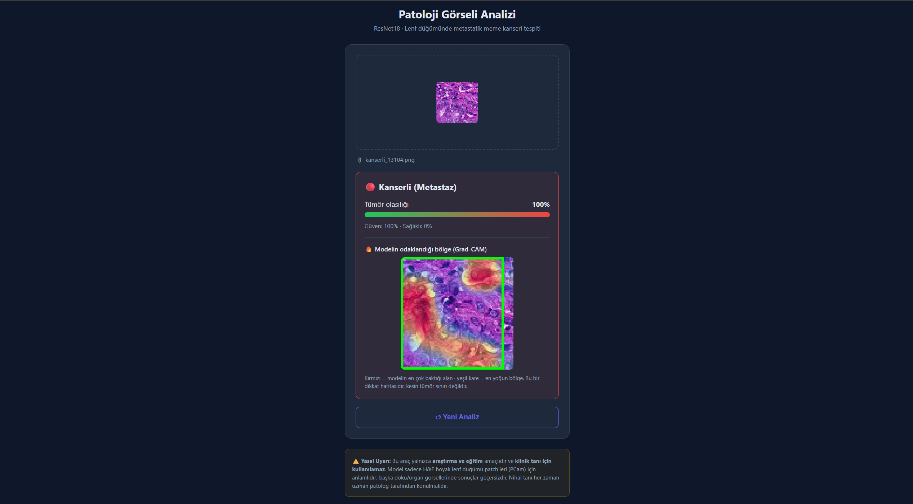
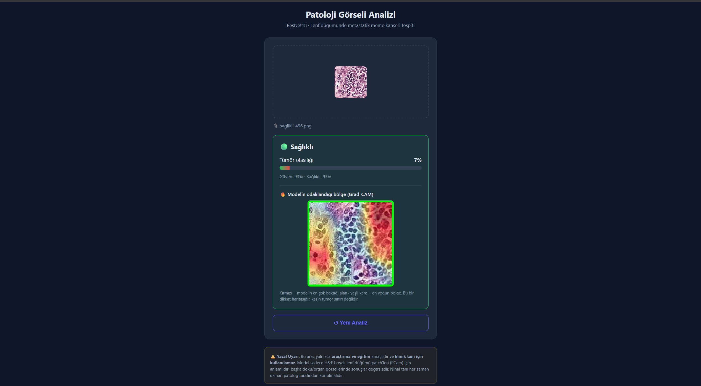
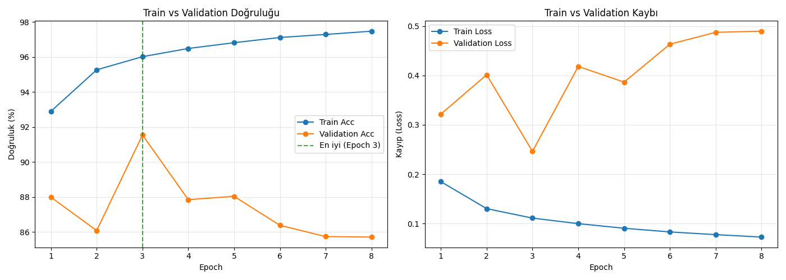

# 🔬 PCam Patoloji Sınıflandırıcı

PatchCamelyon (PCam) veri seti üzerinde **transfer learning + fine-tuning** ile
eğitilmiş bir **ResNet18** modelini web arayüzü üzerinden servis eden uygulama.
Kullanıcı bir patoloji görseli yükler, model **kanserli / sağlıklı** tahmini ve
bir olasılık skoru döndürür.

> ⚠️ **Yasal Uyarı:** Bu proje yalnızca **araştırma ve eğitim** amaçlıdır,
> **klinik tanı için kullanılamaz**. Model yalnızca H&E boyalı lenf düğümü
> patch'leri (PCam formatı, 96×96) için anlamlıdır.

---

## ✨ Özellikler

- **Tahmin + olasılık skoru** — sürükle-bırak ile görsel yükle, anında sonuç
- **Grad-CAM ısı haritası** — modelin odaklandığı bölge (yeşil kare) + ayarlanabilir şeffaflık
- **Güven kalibrasyonu (temperature scaling)** — dürüst güven yüzdesi (ECE ↓)
- **Belirsizlik uyarısı** — karar sınırındaki vakalarda "Belirsiz, uzman incelemesi gerekli"
- **Ayarlanabilir karar eşiği** — recall/precision dengesini slider ile canlı ayarla
- **Model seçimi** — ResNet18 ↔ ResNet50 karşılaştırma
- **Test-time augmentation (TTA)** — 4 varyant ortalaması ile daha kararlı tahmin
- **OOD kontrolü** — H&E/PCam profiline benzemeyen görsellerde "bu görsel uygun değil" uyarısı
- **PDF rapor** — her analiz için indirilebilir çıktı (görsel + Grad-CAM + skor + tarih + uyarı)
- **Hazır örnek galeri** — tıklayınca otomatik analiz edilen örnek görseller
- **Performans sayfası** — confusion matrix, ROC, precision-recall, reliability diyagramı

---

## 🖥️ Ekran Görüntüleri

Model tahmini, olasılık skoru ve **Grad-CAM** ısı haritası (modelin odaklandığı
bölge yeşil kare içinde) ile:

| Kanserli tahmini | Sağlıklı tahmini |
|---|---|
|  |  |

---

## 🩺 Model ne yapıyor?

PCam, **Camelyon16** veri setinden türetilmiştir. Görüntüler meme kanseri
hastalarının **lenf düğümü** kesitleridir (H&E boyalı). Model, bir patch'in
merkezindeki dokuda **metastatik meme kanseri** olup olmadığını sınıflandırır.

- `0 = Sağlıklı`, `1 = Kanserli`
- Girdi: 96×96 RGB patch → `Resize(224)` → ImageNet normalizasyonu
- Çıktı: 2 sınıflı softmax

### Model performansı (ResNet18, final)

| Metrik | Değer |
|---|---|
| Test Doğruluğu | %87.15 |
| Precision | 0.9495 |
| Recall | 0.7846 |
| F1-Score | 0.8592 |

> Not: Recall görece düşük — model gerçek kanserli vakaların ~%22'sini
> kaçırabilir. Bu, klinik kullanıma uygun olmadığının bir göstergesidir.

### Karışıklık Matrisi (tüm test seti — 32.768 örnek)


|  | Tahmin: Sağlıklı | Tahmin: Kanserli |
|---|---|---|
| **Gerçek: Sağlıklı** | 15708 (TN) | 683 (FP) |
| **Gerçek: Kanserli** | 3527 (FN) | 12850 (TP) |

### Eğitim Grafiği (en iyi model: Epoch 3, Val Acc %91.54)



---

## 🏗️ Mimari

```
React (Vite) ──> nginx ──> FastAPI ──> PyTorch (ResNet18)
   frontend/            backend/
```

---

## 🚀 Çalıştırma

### Seçenek A — Docker (önerilen)

```bash
docker compose up --build
```

- Arayüz:  http://localhost:3000
- API:     http://localhost:8000/health

### Seçenek B — Yerel geliştirme

**Backend:**
```bash
cd backend
pip install -r requirements.txt
uvicorn main:app --reload --port 8000
```

**Frontend:**
```bash
cd frontend
npm install
npm run dev
```
Arayüz: http://localhost:5173

---

## 🧪 Test verisi üretme

Arayüzü denemek için PCam test setinden PNG patch'ler çıkar:

```bash
pip install h5py numpy pillow
python export_patches.py --n 20 --out test_patches
```

`test_patches/kanserli/` ve `test_patches/saglikli/` klasörlerine örnekler
düşer; bunları arayüze sürükle-bırak yapıp tahminleri kontrol edebilirsin.

> `data/` klasöründeki `.h5` dosyaları (8.5 GB) repoya dahil DEĞİLDİR.
> PCam'i [buradan](https://github.com/basveeling/pcam) indirebilirsin.

---

## 📁 Proje yapısı

```
PCAM_PROJECT/
├─ backend/            # FastAPI + PyTorch inference
│  ├─ main.py          # /predict endpoint
│  ├─ inference.py     # model yükleme + preprocessing
│  └─ models/          # resnet18_pcam_best.pth
├─ frontend/           # React (Vite) arayüz
├─ export_patches.py   # .h5 -> PNG test aracı
├─ docker-compose.yml
├─ train.py            # (eğitim kodu)
├─ dataset.py          # (veri yükleme + transforms)
└─ evaluate.py         # (test/metrik)
```

---

## 📡 API

`POST /predict` — form-data `file` (görsel)

```json
{
  "prediction": "Kanserli",
  "tumor_probability": 0.9312,
  "healthy_probability": 0.0688,
  "confidence": 0.9312,
  "filename": "kanserli_123.png"
}
```
